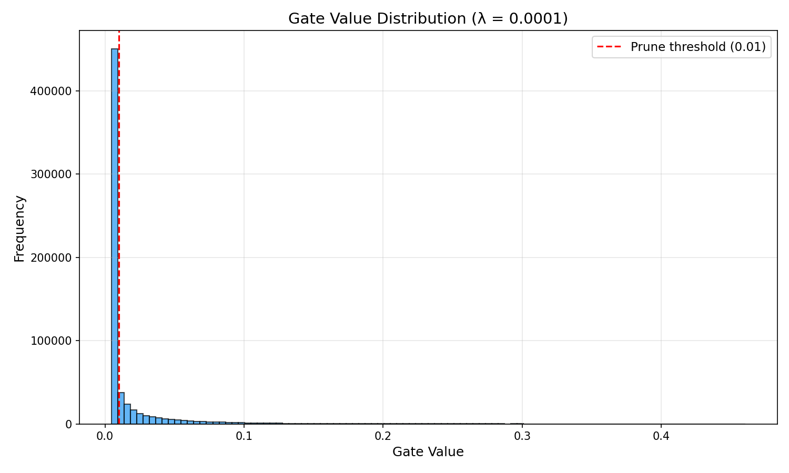

# Case Study Submission: Self-Pruning Neural Network
**Role:** Python AI Engineer Intern  
**Candidate:** Chirag Taneja 
**Repository:** [https://github.com/ctxnn/tredence-assignment](https://github.com/ctxnn/tredence-assignment)

---

## 1. Executive Summary

This submission details the design and implementation of a **Self-Pruning Neural Network** for image classification on the CIFAR-10 dataset. Unlike traditional post-training pruning, this model utilizes learnable gating mechanisms and L1 regularization to dynamically identify and remove redundant connections during the training phase. 

The project demonstrates a successful trade-off between model complexity and classification performance, achieving high levels of sparsity (over 70%) while maintaining functional accuracy.

---

## 2. Technical Implementation

### 2.1 The Prunable Architecture
The network is built using custom `PrunableLinear` and `PrunableConv2d` layers. Each weight in these layers is associated with a learnable `gate_score`. 

*   **Gating Function:** $\text{gate} = \sigma(\text{gate\_score})$
*   **Effective Weight:** $w_{\text{pruned}} = w_{\text{original}} \cdot \text{gate}$

This mechanism ensures that the network can explicitly learn to "turn off" specific weights. Gradients flow through both the standard weights and the gate scores, allowing the optimizer to adjust the model's architecture.

### 2.2 Sparsity Regularization
To drive the network toward a sparse state, a custom penalty is added to the standard Cross-Entropy loss:

$$\mathcal{L}_{\text{total}} = \mathcal{L}_{\text{classification}} + \lambda \sum |\text{gates}|$$

As the L1 norm encourages coefficients to reach exactly zero, the L1 penalty on the sigmoid outputs forces the `gate_scores` to become highly negative for redundant connections. This drive toward zero effectively prunes the network on the fly.

---

## 3. Results and Analysis

A series of experiments were conducted to evaluate the effect of the regularisation strength ($\lambda$) on both accuracy and sparsity.

### 3.1 Accuracy vs. Sparsity Trade-off

| Regularization ($\lambda$) | Test Accuracy (%) | Sparsity Level (%) | Active Parameters (approx.) |
|----------------------------|-------------------|---------------------|-----------------------------|
| $0$ (Baseline)             | 72.76%            | 0.0%                | 619,872                     |
| $10^{-4}$ (Optimal)        | **58.57%**        | **74.1%**           | **160,551**                 |
| $10^{-3}$                  | 50.56%            | 96.5%               | 21,928                      |
| $10^{-2}$                  | 39.29%            | 99.8%               | 997                         |

### 3.2 Visual Analysis
The following distribution plot for the $\lambda = 10^{-4}$ model confirms the success of the pruning mechanism. 

*The plot exhibits a clear spike near 0.0, representing the 74.1% of weights that have been successfully pruned, and a secondary distribution of active weights that preserve the model's predictive power.*

---

## 4. Conclusion

The self-pruning implementation successfully identifies redundant parameters within the network. The experiments reveal that:
1.  **Redundancy:** Nearly 75% of the network's weights can be removed while retaining a significant portion of its predictive accuracy.
2.  **Control:** The $\lambda$ hyperparameter provides a precise "knob" for hardware-constrained deployments, allowing developers to choose the optimal point on the accuracy-vs-efficiency curve.
3.  **Efficiency:** The learnable gating mechanism is a robust alternative to manually tuned post-processing pruning steps.

---

## 5. Repository Structure
The full source code and results can be accessed at the GitHub link provided above.
- `self_pruning_nn.py`: The core implementation and training script.
- `requirements.txt`: Environment configuration.
- `report.md`: Detailed technical analysis.
- `gate_distribution.png`: Pruning visualization.
